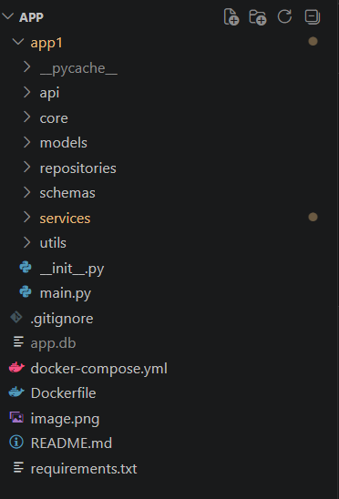
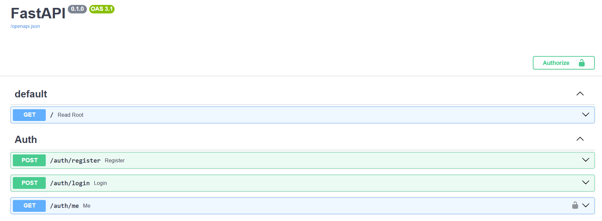
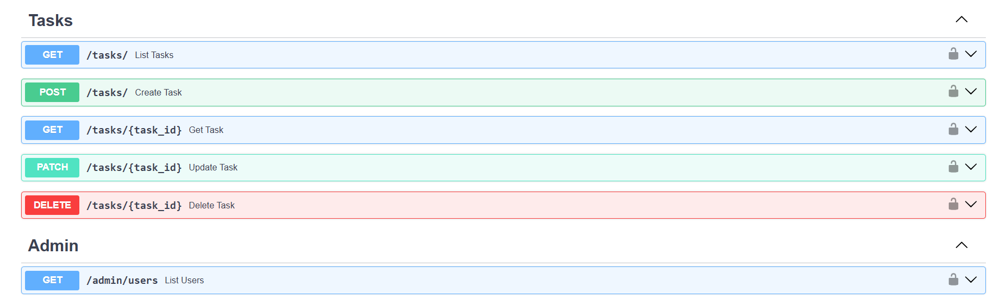
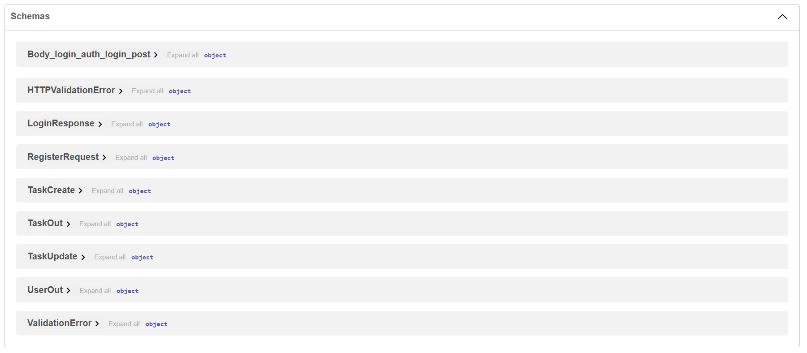

# Task Tracker API

## 📌 Описание
Backend-приложение для управления задачами с использованием FastAPI.

Функционал:
- регистрация и авторизация (JWT)
- управление задачами
- роли пользователей (admin)
- Redis-кэширование

---

## 📁 Структура проекта

- core — конфигурация и безопасность
- models — модели базы данных
- schemas — Pydantic-схемы
- repositories — работа с БД
- services — бизнес-логика
- api — маршруты



---
## Фото работающего функционала







---

## 🚀 Запуск

```bash
docker-compose up --build